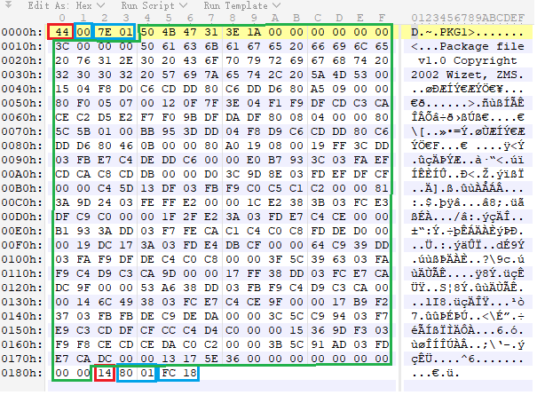

# GMS Patcher

I believe you can't wait to learn how to manually update GMS client, so let's cut to the chase.

## Diff Manifest File

From the previous article, we know that each client version has it's own manifest json file as well as an unique SHA1 file hash. To update a client from older version to newer version, we still need a `.patch` file to describe the file constructing instructions. Let's go over how the traditional patcher works:

> - We use the version code to construct `.patch` file download url.
> - A `.patch` file uses crc32 algorithm to verify old client file, new client file, and the .patch file itself.
> - The `.patch` file declares 3 type of file operations:
>     1. Create or overwrite a file
>     2. Update a file
>     3. Delete a file
> - The `Update` operation consists of 3 type of commands:
>     1. Copy some bytes from `.patch` file
>     2. Fill some repeated bytes
>     3. Copy some bytes from the old file.

In short, GMS still uses a json file to describe the same thing. Instead of the ordinal version code, GMS use the SHA1 hash of the client manifest to constuct the patch file, for example, we know that the SHA1 has of v229.3 is `5ced89cf34977e443b9a81f37341e232ddeec73d` and v230.1 is `0574b97a1a9fd0da8fffb5ac441633d4963463df`, then we could construct the url of the diff manifest file:

```
http://download2.nexon.net/Game/nxl/games/10100/patches/patch-5ced89cf-0574b97a/diff_manifest.hash
```

expected result:

```
62d519ec2b672b799c1e4ae2a9a4f7b03db57637
```

Note the extension of this url is still `.hash`, so the real manifest file url should be:

```
http://download2.nexon.net/Game/nxl/games/10100/patches/patch-5ced89cf-0574b97a/62d519ec2b672b799c1e4ae2a9a4f7b03db57637
```

I believe you have a wealth of experience to decompress this file. It looks like this:

```
{
    "compress_level": 6, 
    "diff_result": [
        {
            "checksum": "707282d5dee8a843e2d118567ae1b857", 
            "file_size": 384, 
            "path": "Base.wz", 
            "type": 1
        }, 
        {
            "checksum": "8f50623408211d12129c10809117dc0e", 
            "file_size": 15983458, 
            "path": "BlackCipher/BlackCall.aes", 
            "type": 1
        }, 
        ......
    ], 
    "dst_deploy_id": "0574b97a1a9fd0da8fffb5ac441633d4963463df", 
    "dst_manifest_hash_url": "http://download2.nexon.net/Game/nxl/games/10100/0574b97a1a9fd0da8fffb5ac441633d4963463df", 
    "patcher_type": "nxdelta", 
    "src_deploy_id": "5ced89cf34977e443b9a81f37341e232ddeec73d", 
    "src_manifest_hash_url": "http://download2.nexon.net/Game/nxl/games/10100/5ced89cf34977e443b9a81f37341e232ddeec73d", 
    "total_size": 531611073, 
    "version": "1.0.0.0"
}
```

The fields are still self-explanatory, to download each `diff_result` file, we can easily construct the address of diff file:

> path: `Base.wz`  
> url: `http://download2.nexon.net/Game/nxl/games/10100/patches/patch-5ced89cf-0574b97a/10100/Base.wz.diff`  

> path: `BlackCipher/BlackCall.aes`  
> url: `http://download2.nexon.net/Game/nxl/games/10100/patches/patch-5ced89cf-0574b97a/10100/BlackCipher/BlackCall.aes.diff`  

The `.diff` file is still being compressed in zlib format, but **don't hurry to decompress it**, the `file_size` is the **compressed size**, and the `checksum` is the **MD5** hash of the compressed file, that's pretty different than other files we have meet.

## Diff file format

OK, we have already download the `.diff` file, maybe you have already tried to decompress it, but you still get another file in binary format that can't open with any text editor. In this section we'll deep into the `.diff` file struct.

For example, here's the hex view of `Base.wz.diff`:



I have already marked out the data elements in the screen shot, the file has only 2 commands so it is very easy to read. Now I will explain how to work with it.

Just like the traditional `.patch` file, each `.diff` file contains one or multiple instructions to regenerate the client file, the difference is that, `.diff` only have two type of the commands:

> 1. Copy some bytes from `.diff` file
> 2. Copy some bytes from the old file.

The complete file structure is like this:

```
{diff file} := {diff command} [..n]
{diff command} := {command flag} {position} {data length} [data bytes]
{command flag} := {data source} {bitlen of position} {bitlen of data length}
```

The command flag is compressed into one byte:

```
76543210 
aa------ source flag, 00-from old file, 01-from diff file
--bb---- bitlen of position, 00-1byte, 01-2bytes, 10-4bytes
----cc-- bitlen of data length, 00-1byte, 01-2bytes, 10-4bytes
------dd unused, always 00
```

If the source flag is `01`(from diff file), the `position` data seems to be the current position of the new file, usually it can be ignored or just used to verify the number of bytes we have writen.

Let's go through the example diff file:

bit index | data | summary
-----|-----|-----
00h | `44` | **cmd 1**, copy from diff file/1 byte position/2 bytes datalen
01h | `00` | position=0
02h-03h | `7E 01` | data length=0x17e
04h-181h | `50 ..` | data bytes, total length is 0x17e
182h | `14` | **cmd 2**, copy from old file/2 bytes position/2 bytes datalen
183h-184h | `80 01` | position=0x180
185h-186h |`fc 18`  | data length=0x18fc
eof |  |  

By executing all commands with the old file, we could construct the new version of the file. in addition, we can validate the new file with client manifest that downloaded from `dst_manifest_hash_url`.

## Summary

Compared with the traditional patcher, the latest GMS patcher has not supported to copy data from multiple old files like KMS does, and it depends on manifest hash, this makes it impossible to sniff the patcher url before Nexon releasing a new version. 

However, I don't think this research is completely meaningless, the GMS patcher is no longer a black box, someone of you can still seek the mysterious of Maplestory, because this game has changed our life.

A sample code will also be attached with this article, but it is not optimized for production ready, please be careful to test the code.

## Credits

Thanks to `Goldentube` for their kind help.

## License

[CC BY-NC 4.0](https://creativecommons.org/licenses/by-nc/4.0/)

## Change log

- 2022-02-13, v1.0
